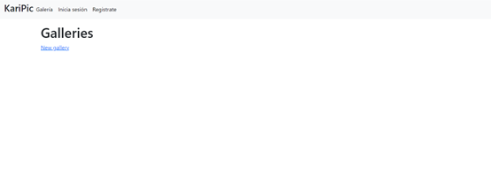
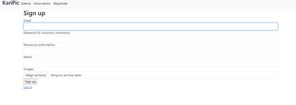
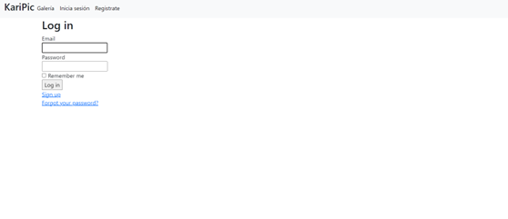
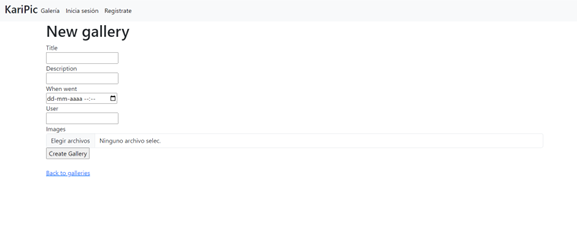

# KariPic

App que exhibe fotografías y recibe comentarios de sus usuarios.

## Visuales










## Empezando 🚀

Estas instrucciones te guiarán para obtener una copia de este proyecto en funcionamiento en tu máquina local para propósitos de desarrollo y pruebas.

### Prerrequisitos 📋

Lista de software y herramientas, incluyendo versiones, que necesitas para instalar y ejecutar este proyecto:

- Sistema Operativo (Ubuntu 22.04)
- Lenguaje de programación (ruby 3.2.2)
- Framework (Rails 7.0.7)
- Base de datos (PostgreSQL 14.8)
- Framework (Bootstrap 5.3)
- Git
- GitHub

### Instalación 🔧

Con estos pasos podrás instalar y ejecutar el proyecto localmente:

1. Clona este repositorio en tu máquina local.

```bash
git clone
git@github.com:alexandraguilarc/KariPic.git
```

2. Ingresa al directorio del proyecto.

```bash
cd KariPic
```
3. Crea las Bases de datos.

```bash
rails db:create
```
4. Realiza las migraciones.

```bash
rails db:migrate
```

## Despliegue 📦

Con estos pasos podrás desplegar el proyecto en un sistema en vivo o ambiente de producción usando Heroku:

1. Clona este repositorio en tu máquina local y subelo a tu repo.

```bash
git clone
git@github.com:alexandraguilarc/KariPic.git
```
2. Ingresa a tu cuenta de Heroku.
3. Selecciona New - Create new app.
4. Agrega el nombre de tu app y pulsa create new app.
5. En Deployment method seleccionas la opción GitHub (connect to GitHub).
6. Agregas el nombre de la app en tu repositorio y pulsas Search.
7. Aparece un botón connect, debes hacer clic.
8. Puedes hacer el deploy manual o automático, pulsas cualquiera de las opciones que te venga mejor y listo debe aparecer un mensaje como este: Your app was successfully deployed..
9. Haces clic en view.
10. Recuerda correr las migraciones y el seed desde la consola de Heroku.

## También puedes:

1. Ingresamos a heroku.
```bash
heroku login
```
2. Creamos nuestra app en heroku.
```bash
heroku create
```
3. Agregamos últimos cambios.
```bash
git add .
```
4. Commit de últimos cambios.
```bash
git commit -m “finished: KariPic”
```
5. subimos cambios a heroku.
```bash
git push heroku main
```
6.Actualizamos la base de datos en heroku.
```bash
heroku run rake db:migrate
```
7. Agregamos variables de entorno a heroku: Ingresamos a nuestra app recién subida en settings.
8. Ingresamos las variables de entorno en el menú llamado “Config Vars”, le damos clic al botón “Reveal Config Vars”.
9. Agregamos nuestras variables de entorno dentro de heroku para que nuestra app pueda utilizarlas.

## Construido Con 🛠️

- [Ruby](https://www.ruby-lang.org/es/) - El lenguaje utilizado
- [Ruby on Rails](https://rubyonrails.org) - El framework web utilizado
- [Ruby gems](https://rubygems.org) - Gestión de dependencias
- [Postgresql](https://www.postgresql.org) - Sistema de base de datos
- [Bootstrap](https://getbootstrap.com/) - Framework de CSS

## Contribuyendo 🖇️

Este proyecto es de código abierto y las contribuciones son bienvenidas. Siente la libertad de enviar tus pull requests para colaborar en mejorar el diseño y agregado de nuevas funcionalidades.

## Versionado 📌

Usamos [Git](https://git-scm.com) para el versionado. Para las versiones disponibles, ve las [etiquetas en este repositorio](git@github.com:alexandraguilarc/KariPic.git).

## Autores ✒️

- **Alexandra Aguilar** - _Trabajo inicial_ - [Alexandra Aguilar](https://github.com/alexandraguilarc)


---

Saludos, con ❤️ por [Alexandra Aguilar](https://github.com/alexandraguilarc) 😊